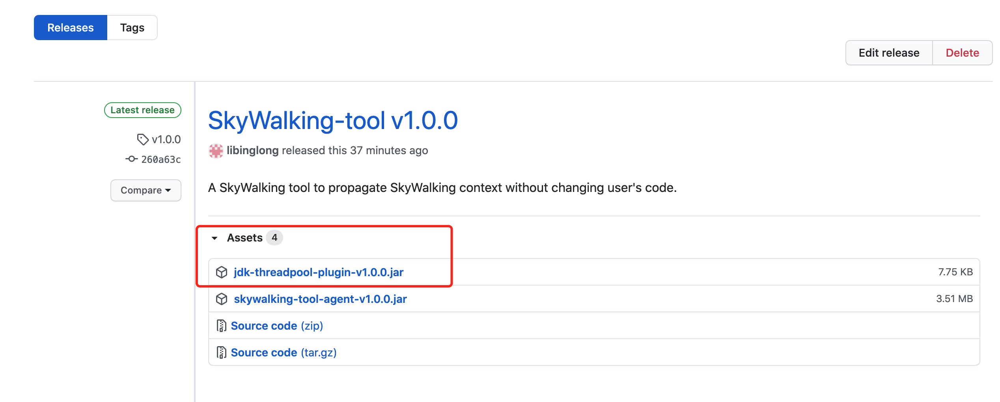

# skywalking-threadpool-agent

This project is designed to make it possible to propagate SkyWalking context without changing user's code when using threadpool.

If the project helps you, please star it!

#### How to propagate

To propagate context between threads, we may want to enhance Runnable first, but it's not good since Runnable is not only 
used in threads.So applying advice of ThreadPoolExecutor#execute to wrap the Runnable param is a good choice.However, it's hard to do 
it.The java agent of SkyWalking usually add a field and implement interface EnhancedInstance when it enhances classes.
It fails when the class of the enhanced instance has been loaded because most JVMs do not allow changes in the class 
file format for classes that have been loaded previously.ThreadPoolExecutor is a special class in the bootstrap class 
path and may be loaded at any code. Fortunately we don't need to change the layout of ThreadPoolExecutor if we just want 
to wrap the Runnable param. So let's write another agent to do this.

> You can not enhance the instance if the class of it has already been loaded.

#### How to wrap the Runnable param?

Note the ThreadPoolExecutor is a bootstrap class. We must inject the wrap class, such as your.own.RunnableWrapper into 
bootstrap classloader.Then you should write a SkyWalking plugin to enhance your.own.RunnableWrapper. There is already a 
RunnableWrapper, org.apache.skywalking.apm.toolkit.trace.RunnableWrapper, but it's hard to use it.

This RunnableWrapper has a plugin whose active condition is checking if there is @TraceCrossThread. Byte buddy in 
SkyWalking will use net.bytebuddy.pool.TypePool.Default.WithLazyResolution.LazyTypeDescription to find the annotations 
of a class. The LazyTypeDescription finds annotations by using a URLClassLoader with no urls if the classloader is 
null(bootstrap classloader). So it can not find the @TraceCrossThread class unless you change the LocationStrategy of 
SkyWalking java agent.

In this project, I write my own wrapper class, and simply add a plugin with a name match condition.

#### How to use

Download the assets from Release.
* [jdk-threadpool-plugin.jar](https://github.com/libinglong/skywalking-threadpool-agent/releases/download/v1.0.0/jdk-threadpool-plugin.jar)

  Move this plugin to the "plugins" directory of SkyWalking agent.
  
  

* [skywalking-tool-agent.jar](https://github.com/libinglong/skywalking-threadpool-agent/releases/download/v1.0.0/skywalking-tool-agent.jar)

  In jvm options, you should add this agent after the SkyWalking java agent since the wrapper class should be enhanced 
  by SkyWalking java agent. For example,

  > java -javaagent:/path/to/skywalking-agent -javaagent:/path/to/tool-agent ...

#### Release

* compatibility sheet

| Tool agent | SkyWalking agent |
| :--------: | :--------------: |
|   1.0.0    | 7.0.0 8.4.0 |

